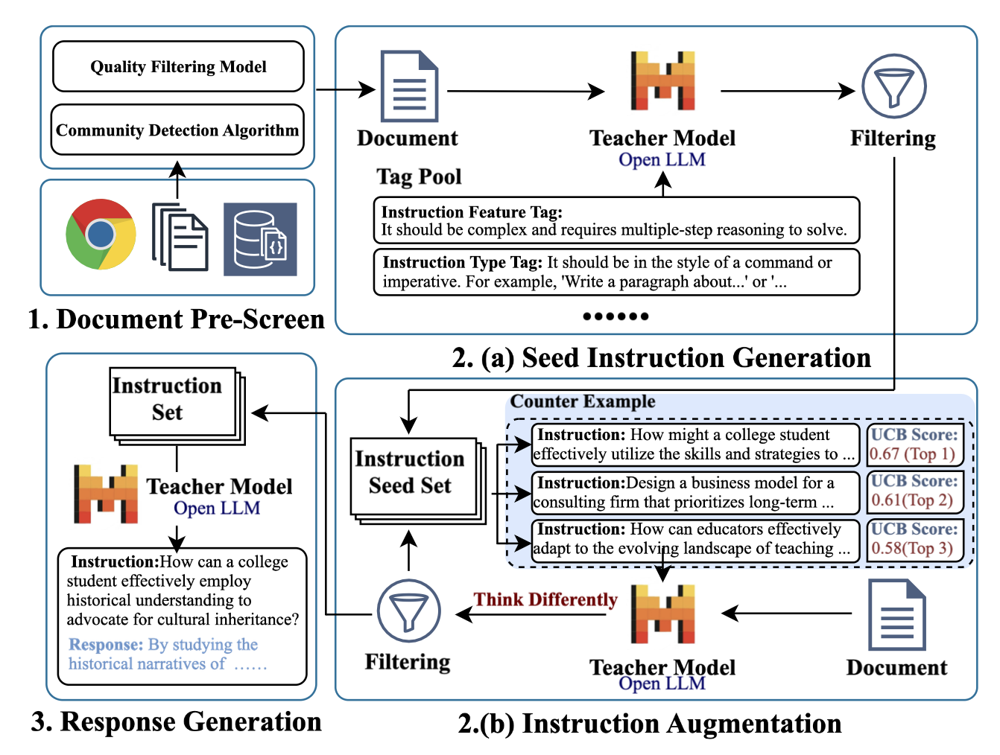
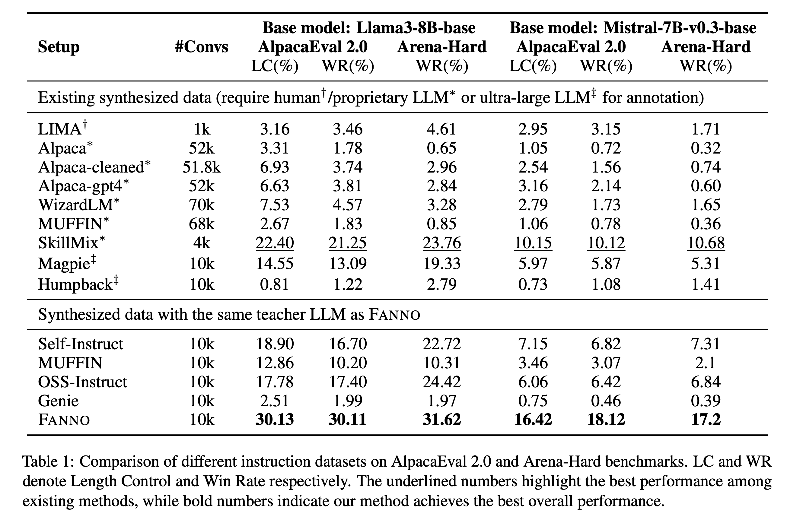

# 🔥 FANNO: Augmenting High-Quality Instruction Data with Open-Sourced LLMs Only

[](https://arxiv.org/abs/2408.01323) [](https://aclanthology.org/2025.findings-acl.906/) [](https://opensource.org/licenses/MIT)

## 📰 News
- [2025/07/27] FANNO paper is accepted to ACL 2025 Findings!
- [2024/08/02] FANNO paper and code are now publicly available on [arXiv](https://arxiv.org/abs/2408.01323) and [GitHub](https://github.com/sustech-nlp/FANNO).

## 📋 Overview

**FANNO (Free ANNOtator)** is an end-to-end framework for synthesizing high-quality instruction data using only open-sourced LLMs and sampled unlabeled documents, eliminating the necessity for seed data or expensive proprietary APIs.

Unlike previous methods that require human-crafted seed datasets or costly proprietary LLMs, FANNO autonomously generates diverse and complex instruction-response pairs through a three-stage process: document pre-screening, instruction generation, and response generation.

## 🔍 Key Innovations

FANNO introduces several breakthrough innovations:

1. **Document Pre-Screening**: Enhances diversity through quality filtering and community detection algorithms
2. **Tagging-Based Seed Generation**: Creates diverse initial instructions across various task types and difficulty levels  
3. **UCB-Based Instruction Augmentation**: Uses Upper Confidence Bound algorithm to select high-quality examples for iterative improvement
4. **Think Different Strategy**: Encourages diverse instruction generation by treating examples as counterexamples
5. **End-to-End Automation**: Requires no human annotation or proprietary API access

## 🧠 Motivation

High-quality instruction data requires correctness, complexity, and diversity. While existing approaches either rely on expensive human annotation or costly proprietary LLMs, FANNO addresses these limitations by:

- **Eliminating seed data requirements**: Automatically generates initial instruction seeds
- **Using only open-source models**: No dependency on expensive APIs like GPT-4
- **Ensuring systematic quality control**: Multi-stage filtering and selection mechanisms
- **Maximizing data efficiency**: Achieves superior performance with only 10K instruction pairs

## 🛠️ Method



The FANNO framework operates in three main stages:

### 1. Document Pre-Screening
Starting from web-scale unlabeled documents, FANNO applies:
- **Quality filtering**: Removes ambiguous content, privacy concerns, and advertisements
- **Length-based selection**: Selects complex documents based on token length correlation with complexity
- **Community detection**: Clusters documents by embeddings to maintain diverse representatives

### 2. Instruction Generation
**Stage 2(a): Seed Instruction Generation**
- Uses tagging-based prompts with task types and difficulty levels
- Generates diverse candidate seeds across various domains
- Filters instructions through LLM-based quality checks

**Stage 2(b): Instruction Augmentation** 
- Applies UCB algorithm to select high-quality seed instructions
- Uses "Think Different" strategy treating examples as counterexamples
- Iteratively generates more complex instructions

### 3. Response Generation
- Directly prompts teacher LLM to generate responses using inherent knowledge
- Assumes instruction tuning activates existing capabilities rather than learning new knowledge
- Avoids document-dependent responses to prevent hallucination

## 📊 Results



FANNO significantly outperforms existing instruction synthesis methods:

**AlpacaEval 2.0 (LLaMA-3-8B-base)**:
- FANNO: 30.13% Length Control, 30.11% Win Rate  
- Best baseline (SkillMix): 22.40% Length Control, 21.25% Win Rate
- Improvement: **+7.73% LC, +8.86% WR**

**Arena-Hard (LLaMA-3-8B-base)**:
- FANNO: 31.62% Win Rate
- Best baseline (OSS-Instruct): 24.42% Win Rate  
- Improvement: **+7.20% WR**

Notably, FANNO achieves these results using only **10K instruction pairs** while many baselines use 52K-70K pairs, demonstrating exceptional data efficiency.

## 🚀 Quick Start

### Prerequisites
Install the required dependencies:
```bash
pip install -r requirements.txt
```

### Step 1: Document Pre-Screening
Process unlabeled documents with quality filtering and community detection:
```bash
python src/document_prescreening.py --input_path /path/to/unlabeled/docs --output_path /path/to/prescreened/docs
```

### Step 2: Seed Instruction Generation  
Generate initial instruction seeds using tagging-based method:
```bash
python src/seed_generation.py --docs_path /path/to/prescreened/docs --output_path /path/to/seed/instructions
```

### Step 3: Instruction Augmentation
Augment instructions using UCB selection and Think Different strategy:
```bash
python src/instruction_augmentation.py --seeds_path /path/to/seed/instructions --output_path /path/to/augmented/instructions
```

### Step 4: Response Generation
Generate responses for all instructions using teacher LLM:
```bash
python src/response_generation.py --instructions_path /path/to/augmented/instructions --output_path /path/to/final/dataset
```

The complete FANNO instruction dataset will be saved in the specified output directory.

### 🧪 Testing
For development and testing purposes, you can use smaller teacher models like LLaMA-3.1-TULU-3-8B by updating the model configuration in the respective scripts.

## 📝 Citation

If you find this work useful, please cite our paper:

```bibtex
@inproceedings{zhu-etal-2025-fanno,
    title = "{FANNO}: Augmenting High-Quality Instruction Data with Open-Sourced {LLM}s Only",
    author = "Zhu, He and Ding, Yifan and Tao, Yicheng and Ruan, Zhiwen and Li, Yixia and Zhang, Wenjia and Chen, Yun and Chen, Guanhua",
    booktitle = "Findings of the Association for Computational Linguistics: ACL 2025",
    month = jul,
    year = "2025",
    address = "Vienna, Austria",
    publisher = "Association for Computational Linguistics",
    url = "https://aclanthology.org/2025.findings-acl.906",
    pages = "17633--17653"
}
```

## 🤝 Contributors

- He Zhu (Peking University)
- Yifan Ding (Shanghai University of Finance and Economics)  
- Yicheng Tao (Southern University of Science and Technology)
- Zhiwen Ruan (Southern University of Science and Technology)
- Yixia Li (Southern University of Science and Technology)
- Wenjia Zhang (Peking University, Tongji University)
- Yun Chen (Shanghai University of Finance and Economics)
- Guanhua Chen (Southern University of Science and Technology) *

*Equal contribution