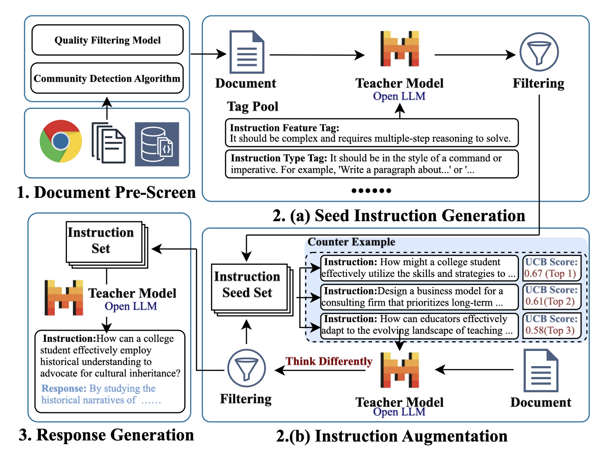
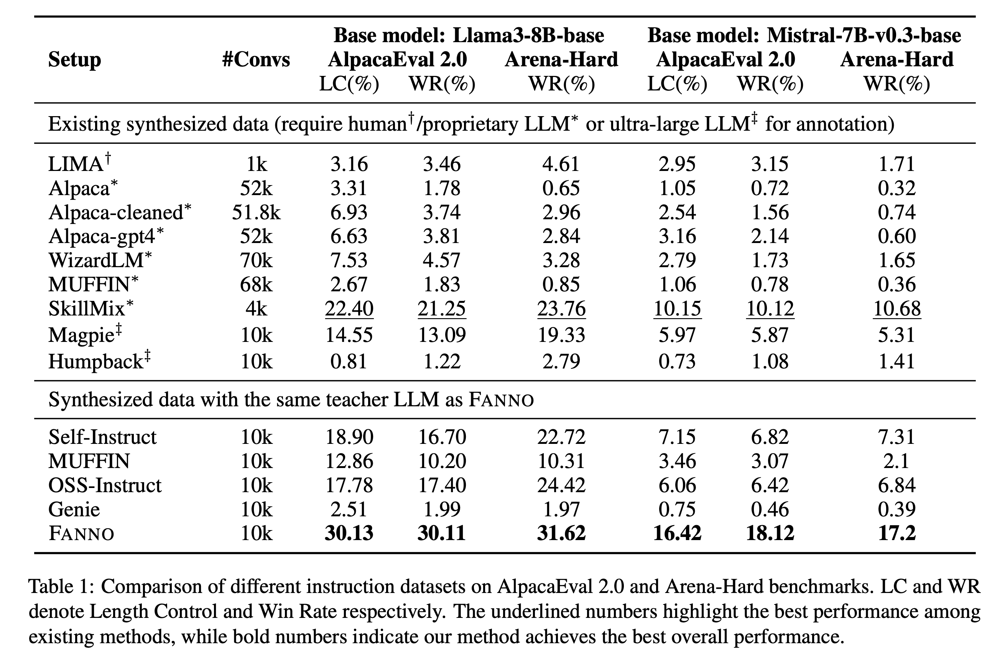

# 🔥 FANNO: Augmenting High-Quality Instruction Data with Open-Sourced LLMs Only

[](https://arxiv.org/abs/2408.01323) [](https://aclanthology.org/2025.findings-acl.906/) [](https://opensource.org/licenses/MIT)

## 📰 News
- [2025/07/27] FANNO paper is accepted to ACL 2025 Findings!
- [2024/08/02] FANNO paper and code are now publicly available on [arXiv](https://arxiv.org/abs/2408.01323) and [GitHub](https://github.com/sustech-nlp/FANNO).

## 📋 Overview

**FANNO (Free ANNOtator)** is an end-to-end framework for synthesizing high-quality instruction data using only open-sourced LLMs and sampled unlabeled documents, eliminating the necessity for seed data or expensive proprietary APIs.

Unlike previous methods that require human-crafted seed datasets or costly proprietary LLMs, FANNO autonomously generates diverse and complex instruction-response pairs through a three-stage process: document pre-screening, instruction generation, and response generation.

## 🔍 Key Innovations

FANNO introduces several breakthrough innovations:

1. **Document Pre-Screening**: Enhances diversity through quality filtering and community detection algorithms
2. **Tagging-Based Seed Generation**: Creates diverse initial instructions across various task types and difficulty levels  
3. **UCB-Based Instruction Augmentation**: Uses Upper Confidence Bound algorithm to select high-quality examples for iterative improvement
4. **Think Different Strategy**: Encourages diverse instruction generation by treating examples as counterexamples
5. **End-to-End Automation**: Requires no human annotation or proprietary API access
6. **DiversityBench-inspired decoding**: Optional temperature, aspect, and iterative strategies for richer generations plus perplexity/IFD-based scoring

## 🧠 Motivation

High-quality instruction data requires correctness, complexity, and diversity. While existing approaches either rely on expensive human annotation or costly proprietary LLMs, FANNO addresses these limitations by:

- **Eliminating seed data requirements**: Automatically generates initial instruction seeds
- **Using only open-source models**: No dependency on expensive APIs like GPT-4
- **Ensuring systematic quality control**: Multi-stage filtering and selection mechanisms
- **Maximizing data efficiency**: Achieves superior performance with only 10K instruction pairs

## 🛠️ Method



The FANNO framework operates in three main stages:

### 1. Document Pre-Screening
Starting from web-scale unlabeled documents, FANNO applies:
- **Quality filtering**: Removes ambiguous content, privacy concerns, and advertisements
- **Length-based selection**: Selects complex documents based on token length correlation with complexity
- **Community detection**: Clusters documents by embeddings to maintain diverse representatives

### 2. Instruction Generation
**Stage 2(a): Seed Instruction Generation**
- Uses tagging-based prompts with task types and difficulty levels
- Generates diverse candidate seeds across various domains
- Filters instructions through LLM-based quality checks

**Stage 2(b): Instruction Augmentation** 
- Applies UCB algorithm to select high-quality seed instructions
- Uses "Think Different" strategy treating examples as counterexamples
- Iteratively generates more complex instructions

### 3. Response Generation
- Directly prompts teacher LLM to generate responses using inherent knowledge
- Assumes instruction tuning activates existing capabilities rather than learning new knowledge
- Avoids document-dependent responses to prevent hallucination

## 📊 Results



FANNO significantly outperforms existing instruction synthesis methods:

**AlpacaEval 2.0 (LLaMA-3-8B-base)**:
- FANNO: 30.13% Length Control, 30.11% Win Rate  
- Best baseline (SkillMix): 22.40% Length Control, 21.25% Win Rate
- Improvement: **+7.73% LC, +8.86% WR**

**Arena-Hard (LLaMA-3-8B-base)**:
- FANNO: 31.62% Win Rate
- Best baseline (OSS-Instruct): 24.42% Win Rate  
- Improvement: **+7.20% WR**

Notably, FANNO achieves these results using only **10K instruction pairs** while many baselines use 52K-70K pairs, demonstrating exceptional data efficiency.

## 🚀 Quick Start

### Installation
Install dependencies (includes vLLM, transformers, Azure client support):
```bash
pip install -r requirements.txt
```

Install FANNO in editable mode to get the CLI:
```bash
pip install -e .
```

### Step 1: Run the pipeline
Execute the end-to-end pipeline with the default config:
```bash
fanno --config src/fanno/config.yaml
```
Or pick a preset:
```bash
fanno --config configs/azure_gpt5.yaml      # Azure GPT-5 teacher
fanno --config src/fanno/config.yaml        # local vLLM teacher
```

Key behaviors:
- **Seed Instruction Generation**: tagging-based prompts over unlabeled docs
- **Instruction Augmentation**: UCB selection + Think-Different sampling
- **Response Generation**: vLLM-backed inference with optional diversity strategies (`temperature_sweep`, `dynamic_temperature`, `aspect`, `iterative`)
- **Instruction Value Scoring**: combines perplexity + IFD to rank and filter instructions

Artifacts are written under `outputs/<run_name>/` by default and can be customized via the YAML config.

Key config toggles:
- `pipeline.seed_gen_strategy`: seed prompt style (default `tagging`)
- `pipeline.ins_aug_strategy`: instruction augmentation (default `ucb`)
- `pipeline.think_diff_strategy`: Think-Different prompt builder (`ucb` or `random`)
- `pipeline.response_strategy`: `basic`, `temperature_sweep`, `dynamic_temperature`, `aspect`, or `iterative`
- `pipeline.diversity_samples`: how many variants to sample per strategy
- `metrics.perplexity_model` / `metrics.ifd_prompt_temperature`: control instruction-value scoring (perplexity + IFD)
- `inference.model_name_or_path`: vLLM backend used for all generations

Paths and outputs:
- Input data: `files.unlabeled_data_path` / `files.com_unlabeled_data_path` (JSONL with `{"doc": ...}`); defaults to `./data/`.
- Outputs: under `files.output_dir/run_name` (default `outputs/response-100k/`).
- Seeds and augmented data: `initial_seed.jsonl`, `ucb_aug_*.jsonl`; final merged set: `final_data.jsonl`.

### Inference backends
- Local vLLM: `fanno.inference.vllm_inference.parallel_inference` (default in pipeline)
- Azure OpenAI: `fanno.inference.client_inference.client_parallel_inference`

See `docs/inference.md` and the example scripts:
- `python scripts/vllm_inference_demo.py`
- `python scripts/azure_inference_demo.py`

## Quick Start (minimal)
```bash
pip install -r requirements.txt
pip install -e .
# edit src/fanno/config.yaml to point to your model and data paths
fanno --config src/fanno/config.yaml
```

## Config examples
Local vLLM teacher (Qwen):
```yaml
inference:
  backend: vllm
  model_name_or_path: Qwen/Qwen2.5-7B-Instruct
  tensor_parallel_size: 1
  temperature: 0.0
  top_p: 0.9
  max_tokens: 1024

pipeline:
  seed_docs_num: 50
  window_size: 500
  limit_size: 5000
  diversity_samples: 3
  seed_gen_strategy: tagging
  ins_aug_strategy: ucb
  instruction_quality_strategy: combined
  response_strategy: basic
  think_diff_strategy: ucb

files:
  data_dir: ./data
  unlabeled_data_path: ./data/unlabel_data.jsonl
  com_unlabeled_data_path: ./data/unlabel_data_com.jsonl
  output_dir: ./outputs
  run_name: response-local
```

Azure GPT-5 teacher (see `configs/azure_gpt5.yaml`):
```yaml
inference:
  backend: azure
  model_name_or_path: gpt-5
  azure_tenant_id: 72f988bf-86f1-41af-91ab-2d7cd011db47
  azure_api_version: 2024-12-01-preview
  azure_max_retries: 5
  temperature: 0.7
  top_p: 0.9
  max_tokens: 1024

pipeline:
  seed_docs_num: 50
  window_size: 500
  limit_size: 5000
  diversity_samples: 3
  seed_gen_strategy: tagging
  ins_aug_strategy: ucb
  instruction_quality_strategy: combined
  response_strategy: basic
  think_diff_strategy: ucb

files:
  data_dir: ./data
  unlabeled_data_path: ./data/unlabel_data.jsonl
  com_unlabeled_data_path: ./data/unlabel_data_com.jsonl
  output_dir: ./outputs
  run_name: response-gpt5
```

## GitHub Stars


### 🧪 Testing
For development and testing purposes, you can use smaller teacher models like LLaMA-3.1-TULU-3-8B by updating the model configuration in the respective scripts.

## 📝 Citation

If you find this work useful, please cite our paper:

```bibtex
@inproceedings{zhu-etal-2025-fanno,
    title = "{FANNO}: Augmenting High-Quality Instruction Data with Open-Sourced {LLM}s Only",
    author = "Zhu, He and Ding, Yifan and Tao, Yicheng and Ruan, Zhiwen and Li, Yixia and Zhang, Wenjia and Chen, Yun and Chen, Guanhua",
    booktitle = "Findings of the Association for Computational Linguistics: ACL 2025",
    month = jul,
    year = "2025",
    address = "Vienna, Austria",
    publisher = "Association for Computational Linguistics",
    url = "https://aclanthology.org/2025.findings-acl.906",
    pages = "17633--17653"
}
```

## 🤝 Contributors

- He Zhu (Peking University)
- Yifan Ding (Shanghai University of Finance and Economics)  
- Yicheng Tao (Southern University of Science and Technology)
- Zhiwen Ruan (Southern University of Science and Technology)
- Yixia Li (Southern University of Science and Technology)
- Wenjia Zhang (Peking University, Tongji University)
- Yun Chen (Shanghai University of Finance and Economics)
- Guanhua Chen (Southern University of Science and Technology)
